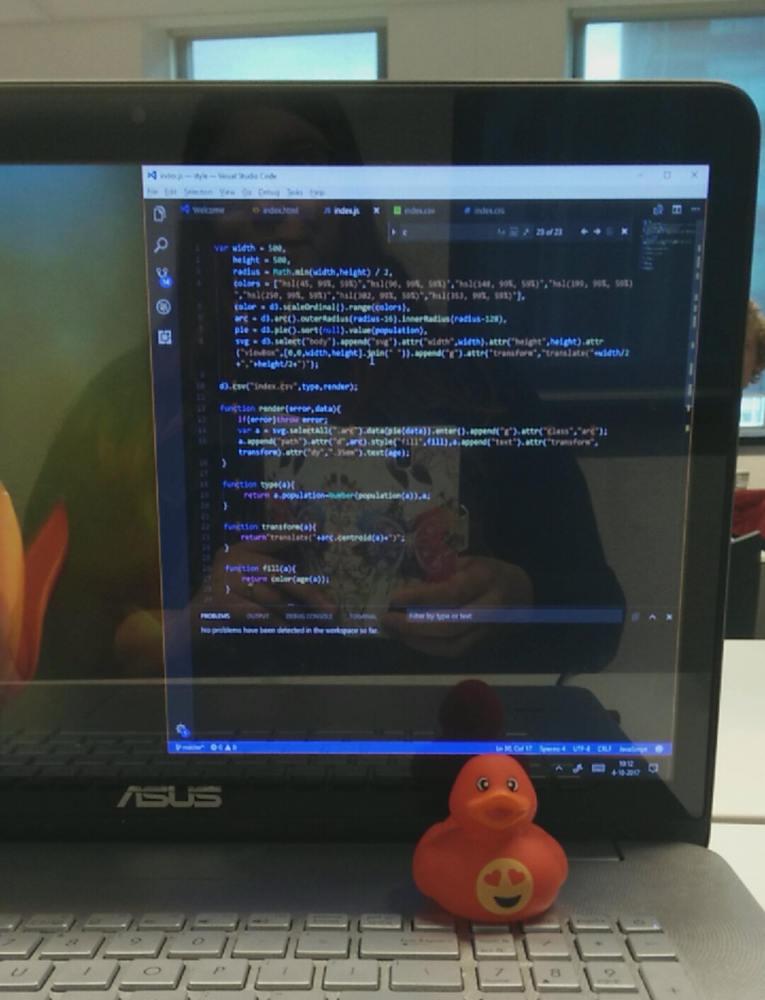
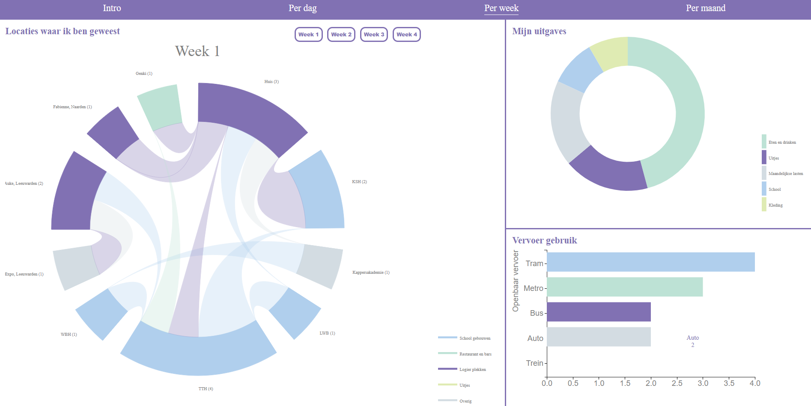

# Extra tima

During this course I learned to talk to my rubber duck. I had him always on my desk so he could see my suffer face while working on the assignments and assessments. At the beginning I found it funny and didn't think it would work, but the more complicated the course were the more I began to talk to my duck. Afterwards he was a life saving because he often helped me out when I was looking for one problem and couldn't see while the problem was just right in front of me.

## Materials I used:
While, I was working with the d3.js I always used the [D3 Api Reference](https://github.com/d3/d3/blob/master/API.md#requests-d3-request) to read about the functionalities of a code from d3. Beside that I also used the [fe(3)](https://cmda-fe3.github.io/course-17-18/) github website to see how the codes of a graph were written and to learn about it.

- I took a [SVG Tutorial](https://www.w3schools.com/graphics/svg_intro.asp) from w3schools. From this tutorial I have learned the essentials of ' SVG ' and how to apply them.

- For a better understanding in how 'd3.js' works I took the course [Learning Data Visualization with D3.js] (https://www.lynda.com/D3-js-tutorials/Learning-Data-Visualization-D3-js/594451-2.html?certificate=5A2F75EEEA3C42B98D907E5D61DD1166&notSocialLink=true) in Lynda.com. In this course I learned to use the basic applications of the library.

- I used the guide [Learn JS data](http://learnjsdata.com/) to have a better understanding in how the 'external data' works with d3.js.

- I used the link [mastering Markdown](https://guides.github.com/features/mastering-markdown/) to find out what my possibilities were by writing with 'Markdown language'.

- I used [D3 V4 - What's new?](https://iros.github.io/d3-v4-whats-new/#1) to help me 'debugging' by the assingments that I did. A lot of the d3 example on the internet were written in V3 of d3. So through this slides I could see what changes were made between 'd3.js V3 and v4'.

- I also used this link, [Update d3.js scripts from V3 to V4](https://amdevblog.wordpress.com/2016/07/20/update-d3-js-scripts-from-v3-to-v4/) to help me update the code from 'd3.js V3 to V4'.

- I used the guide [Basic D3 Graphs](https://website.education.wisc.edu/~swu28/d3t/visualization.html) to have a better understanding of ' d3.js'. I found this guide helpful beacuse it examples what a code in d3 does in a very easy and understandable way.

- In the article [Enter, Update, Exit](https://medium.com/@c_behrens/enter-update-exit-6cafc6014c36) I could read about the joins 'Enter, Update and Exit'. At teh beginning I found it really hard to understand how this joins works and how to apply them. After reading this artikel I had a better idea of how I could apply it and what to expect from it.

- With this article [Using HTML inputs with d3.js](http://www.d3noob.org/2014/04/using-html-inputs-with-d3js.html) I could understand better how to apply an HTML input to use it for to create 'interactive visualizations'

## Create multiple visualizations on the same page
For the subject "Datavisualizatie" I also got the assessment to create a prototype with multiple visualizations on the same page with data that I collected myself. The data I used was from my daily life.

To create this prototype I had the option to use Illustrator with another prototyping tool (like Invision) or try it with code (d3.js). In the end I chose to make my prototype with 'd3.js'. By doing that I could keep in touch with this library and have a better understanding in how it works to be able to apply it on my final assessment for Front end 3.

For the assessment for "Datavisualisatie" I did not focus on writing good code. Unfortunately, I hadn't time enough for that. I had to priority my tasks and focused on the deliverables for the subject and on understanding the code that I was using. For this prototype I used a 'chord diagram', a 'donut chart' and a 'horizontal bar chart'.

To see the live prototype you can go to (www.lbraga.nl/datavis).

When, I was writing the code I found it a little hard to make the three graph that I made work together. I honestly don't think that the code that I written would be something that I would hand in for FE. But because I hadn't the time I had to do how it worked out for me. It took me already a long time to figure out how I would put this three graphs together and understand the code. For a next time I would like to see my code and write it in a nice readable way and make it also responsive.
